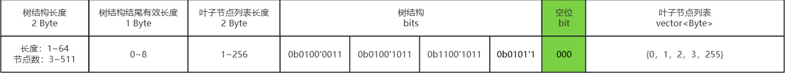
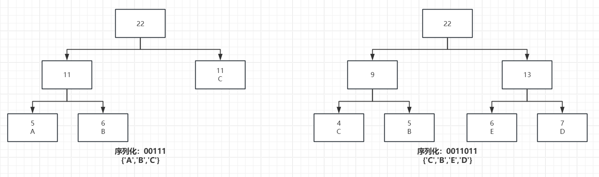

## 编码约定
- 大端模式

## 哈夫曼树序列化结构
- 节点最多511个
- 子节点最多256个



前序遍历获取哈夫曼树结构，0节点，1叶子，1出现顺序和叶子节点列表一一对应。

编码伪代码：
```C++
void encode(const HuffmanNode *node,
                     const std::string &code,
                     HuffmanCollector &huffmanCollector) {
    if (!node) {
      return;
    }
    huffmanCollector.onEnter(node, code);
    generate(node->left.get(), code + "0", huffmanCollector);
    generate(node->right.get(), code + "1", huffmanCollector);
}
```

解码伪代码：

```c++
void decode(const uint8_t *bits, int bitIdx, const string& code) {
    if (bits[bitIdx] == 1) {
        decodeMap[code] = nodeList[idx++];
        return;
    } else {
        decode(bits, bitIdx, huffmanCollector, code + "0");
        decode(bits, bitIdx, huffmanCollector，code + "1");
    }
}
```


