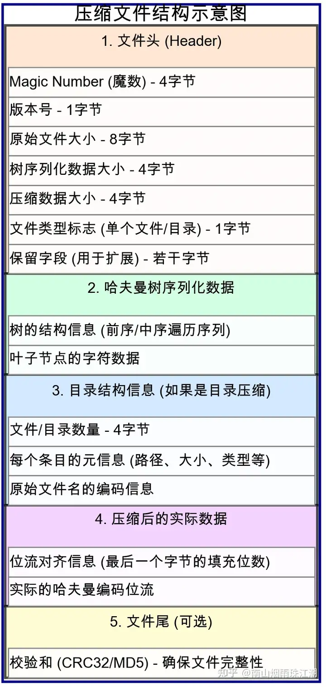

## 编码约定
- 大端模式

## 文件头



## 哈夫曼树序列化结构
- 节点最多511个
- 子节点最多256个


前序遍历获取哈夫曼树结构，0节点，1叶子，1出现顺序和叶子节点列表一一对应。

> Q: 为什么不需要记录哈夫曼树bit数组结尾有效数据位？<br/>
> A: 因为叶子节点遍历完即完成

编码伪代码：
```C++
void encode(const HuffmanNode *node,
                     const std::string &code,
                     HuffmanCollector &huffmanCollector) {
    if (!node) {
      return;
    }
    huffmanCollector.onEnter(node, code);
    generate(node->left.get(), code + "0", huffmanCollector);
    generate(node->right.get(), code + "1", huffmanCollector);
}
```

解码伪代码：

```c++
void decode(const uint8_t *bits, int bitIdx, const string& code) {
    if (bits[bitIdx] == 1) {
        decodeMap[code] = nodeList[idx++];
        return;
    } else {
        decode(bits, bitIdx, huffmanCollector, code + "0");
        decode(bits, bitIdx, huffmanCollector，code + "1");
    }
}
```


# 代码风格
## 基于 clang-format LLVM
```
# 属性后换行
BreakAfterAttributes: Always
# 模板 template 后换行
AlwaysBreakTemplateDeclarations: Yes
```
## 指定初始化器 (C++20)
不知道怎么该 clang-format，还是不要用了，默认 LLVM 会把下面代码：
```c++
Header header{
    .magicNumber = MAGIC_NUMBER,
    .version = VERSION_NUMBER,
    .isDirectory = false,
    .extend = 0
};
```
改成：
```c++
Header header{.magicNumber = MAGIC_NUMBER,
            .version = VERSION_NUMBER,
            .isDirectory = false,
            .extend = 0};
```

# 日志
## 项目-01
- 实现静态哈夫曼编码
    - 频率统计 （第一次扫描）
    - 建树，建表 （第二次扫描）
    - 序列化树和表
    - 编码源文件
- 实现静态哈夫曼编码
    - 建树
    - 解码压缩文件

静态哈夫曼编码：第一次全文件遍历统计字符频率、第二次全文件遍历编码字符。

动态哈夫曼编码：分块静态哈夫曼编码

## 项目-02
